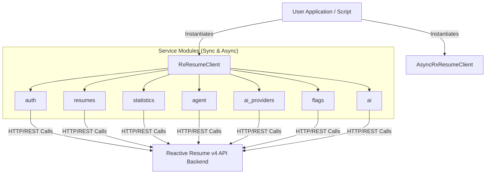

# Reactive Resume Python SDK (`rxresume-python`)

[](https://www.python.org/downloads/)
[](https://docs.pydantic.dev/)
[](https://www.python-httpx.org/)

An unofficial modern, type-safe Python API Client (SDK) for **Reactive Resume v4**.

It supports both synchronous (`httpx.Client`) and asynchronous (`httpx.AsyncClient`) clients, ensures fully typed request/response schemas using **Pydantic v2**, and maps API errors to clean, descriptive Python exceptions.

---

## Features

- **Dual client modes**: Support for both sync and async APIs.
- **Full API coverage**: Integrated modules for Resume management, Auth, AI Agent prompts, AI Providers configurations, Statistics, and Feature Flags.
- **Type safety**: Fully typed models for all entities using Pydantic V2.
- **Robust error handling**: Raw API status errors are automatically parsed into specific exceptions (`AuthenticationError`, `NotFoundError`, etc.).
- **Developer Experience (DX)**: Code-completion ready with clear typing and docstrings.

---

## Architecture



---

## Capability Matrix

| Service Module | Sync | Async | Key Mapped Endpoints (Postman Collection) |
| :--- | :---: | :---: | :--- |
| **Resumes** (`client.resumes`) | Yes | Yes | List, Get, Create, Update, Delete, Import, Set/Verify/Remove Password, Duplicate, Lock, Version History, Public Resume |
| **Auth** (`client.auth`) | Yes | Yes | Login, Get Me, List Providers, Export Account, Delete Account |
| **Statistics** (`client.statistics`) | Yes | Yes | Get Statistics, Get Daily Statistics |
| **Agent** (`client.agent`) | Yes | Yes | Chat Context, List Threads, Get Thread Details |
| **AI Providers** (`client.ai_providers`) | Yes | Yes | List, Create, Update, Delete, Test saved AI providers |
| **AI Functions** (`client.ai`) | Yes | Yes | Parse PDF, Parse DOCX, Chat, Analyze Resume |
| **Feature Flags** (`client.flags`) | Yes | Yes | List Server-side Feature Flags |


## Installation

Install the package via `pip` or your favorite package manager:

```bash
pip install rxresume-python
```

---

## Quick Start

### 1. Asynchronous Client (FastAPI / Asynchronous Code)

```python
import asyncio
from reactive_resume import AsyncRxResumeClient
from reactive_resume.models import ResumeImportData, Basics

async def main():
    # Initialize the async client
    async with AsyncRxResumeClient(base_url="https://rxresu.me", api_key="your_api_key") as client:
        # Create a new resume
        import_data = ResumeImportData(
            title="Ata Can Yaymacı - Backend Engineer",
            basics=Basics(
                name="Ata Can Yaymacı",
                headline="Backend Engineer",
                email="ata@example.com",
                phone="+905555555555",
                website="https://example.com"
            ),
            sections={}
        )

        try:
            # Import/Create a new resume
            new_resume = await client.resumes.import_resume(import_data)
            print(f"Created resume: {new_resume.name} (ID: {new_resume.id})")

            # Fetch the generated PDF URL
            pdf_url = await client.resumes.get_pdf_url(new_resume.id)
            print(f"PDF URL: {pdf_url}")

        except Exception as e:
            print(f"An error occurred: {e}")

if __name__ == "__main__":
    asyncio.run(main())
```

### 2. Synchronous Client

```python
from reactive_resume import RxResumeClient
from reactive_resume.models import ResumeImportData

with RxResumeClient(base_url="https://rxresu.me", api_key="your_api_key") as client:
    resumes = client.resumes.list()
    for resume in resumes:
        print(f"Resume: {resume.name} (Slug: {resume.slug})")
```

### 3. Advanced Features (AI Agent, Statistics, Flags, AI)

```python
with RxResumeClient(base_url="https://rxresu.me", api_key="your_api_key") as client:
    # 1. Ask the AI agent to optimize a resume summary
    ai_response = client.agent.chat("resume_id_here", "Suggest a professional summary for a software developer.")
    print(f"AI Suggestion: {ai_response.response}")

    # 2. Retrieve resume metrics
    stats = client.statistics.get("resume_id_here")
    print(f"Views: {stats.views}, Downloads: {stats.downloads}")

    # 3. Parse a PDF resume into raw resume data
    parsed_cv = client.ai.parse_pdf("my_resume.pdf", "base64_encoded_file_data_here", "ai_provider_id_here")
    print(f"Parsed Name: {parsed_cv.get('basics', {}).get('name')}")

    # 4. Check server-side feature flags
    flags = client.flags.list()
    print(f"Signups disabled: {flags.get('isSignupsDisabled')}")

```


---


## Error Handling

All client API calls map HTTP errors to specific exception classes:

```python
from reactive_resume import RxResumeClient, AuthenticationError, NotFoundError

try:
    with RxResumeClient(base_url="https://rxresu.me", api_key="wrong_key") as client:
        client.resumes.list()
except AuthenticationError as e:
    print(f"Auth error (Status {e.status_code}): {e}")
except NotFoundError as e:
    print(f"Not found: {e}")
except Exception as e:
    print(f"Generic error: {e}")
```

---

## Development & Testing

1. Clone the repository:
   ```bash
   git clone https://github.com/your-username/reactive-resume-api-client-py.git
   cd reactive-resume-api-client-py
   ```

2. Install dependencies:
   ```bash
   python3 -m venv .venv
   source .venv/bin/activate
   pip install -e ".[dev]"
   ```

3. Run the tests:
   ```bash
   pytest
   ```

---

## License

This project is licensed under the MIT License - see the LICENSE file for details.
